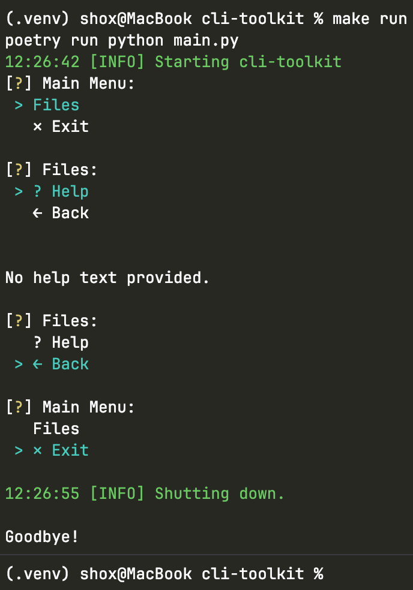

# cli-toolkit

Python CLI starter kit – ready-to-use base for internal automation tools.

<small>Fork or use as
a [GitHub Template](https://docs.github.com/en/repositories/creating-and-managing-repositories/creating-a-repository-from-a-template)
to skip the boilerplate on every new project.
</small>

---

## Features

| Module           | Description                                                          |
|------------------|----------------------------------------------------------------------|
| `app/cli`        | Interactive menus, Back / Exit / Help commands                       |
| `app/config`     | Config loader – `.env` + `config.yaml` merged into a typed dataclass |
| `app/exceptions` | Base exception hierarchy                                             |
| `app/files`      | Read & write Excel, CSV, JSON, YAML; interactive file/dir selector   |
| `app/logging`    | Coloured console + rotating file logger                              |
| `app/paths`      | Typed path helpers with auto directory creation                      |
| `app/utils`      | Progress bar wrapper around `tqdm`                                   |

---

## Requirements

- Python 3.11+
- Poetry 2+

---

## Quick start

```bash
# 1. Clone / use as template
git clone https://github.com/yuldashov10/cli-toolkit.git
cd cli-toolkit

# 2. Install dependencies
make install-dev

# 3. Configure
cp .env.example .env

# 4. Run
make run
```

---

## Project structure

```
.
├── app/
│   ├── cli/          # Menu, commands
│   ├── config/       # Config loader
│   ├── exceptions/   # Exception hierarchy
│   ├── files/        # Readers, writers, selectors
│   ├── logging/      # Logger
│   ├── paths/        # Path helpers
│   └── utils/        # Progress bar
├── config.yaml
├── docs/
│   └── images/       # Screenshots and assets
├── .env.example
├── main.py
├── pyproject.toml
├── tests/
│   ├── conftest.py   # Shared fixtures
│   └── test_*.py     # Tests for each module
└── Makefile
```

---

## Configuration

Settings are merged in this order (highest priority first):

1. Environment variables / `.env`
2. `config.yaml`
3. Dataclass defaults

```yaml
# config.yaml
app_name: cli-toolkit
log_level: INFO      # DEBUG | INFO | WARNING | ERROR | CRITICAL
downloads_dir: ~/Downloads
```

---

## Usage

```bash
make install-dev   # install all dependencies + pre-commit hooks
make run           # run the project
make format        # black + isort
make check         # flake8 + isort + black (no changes)
make test          # pytest
make commit        # commitizen commit
```

---

## Testing

```bash
make test          # run tests
make cov           # run tests with coverage report
```

Tests cover:

- `app/exceptions` – exception hierarchy, `hint`, `path`, `__str__`
- `app/files` – readers, writers (roundtrip), selectors
- `app/paths` – path resolution, `ensure=True`, `exists()`
- `app/config` – config loading priorities (env → yaml → defaults)

---

## Preview



---

## License

[MIT](./LICENSE)
